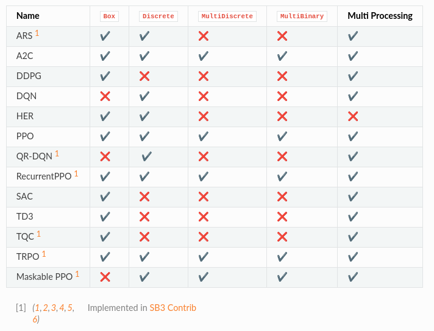

# Stable baseline 3 learning

## Install

Со всеми зависимостями: `pip install stable-baselines3[extra]` (tensorboard and etc)

[Проблема установки](https://github.com/DLR-RM/stable-baselines3/issues/1324) (python 3.10+) - полечить: `pip install -U setuptools==65.5.0`

Для запуска визализаций возможно [потребуется поставить](https://stackoverflow.com/questions/74314778/nameerror-name-glpushmatrix-is-not-defined) более старую версию: `pip install pyglet==1.5.27`

Чтобы поставить в докере нужен [nvidia-docker](https://github.com/NVIDIA/nvidia-docker)

### Другие известные проблему

- [AttributeError: module 'gym.envs.box2d' has no attribute 'LunarLander'](https://github.com/openai/gym/issues/1423)
- [AttributeError: module '_Box2D' has no attribute 'RAND_LIMIT_swigconstant'](https://stackoverflow.com/questions/50037674/attributeerror-module-box2d-has-no-attribute-rand-limit-swigconstant)

## [Ограничения](https://stable-baselines3.readthedocs.io/en/master/guide/rl_tips.html#discrete-actions)

Алгоритмы RL без моделей SB3 обычно неэффективны с точки зрения выборки. Им требуется множество примеров (иногда миллионы взаимодействий), чтобы узнать что-то полезное. Вот почему большая часть успехов в RL была достигнута только в играх или симуляциях. Общий совет: для повышения производительности следует увеличить бюджет агента (количество временных шагов обучения). Для достижения желаемого поведения часто требуются экспертные знания для разработки адекватной функции вознаграждения. Эта разработка вознаграждения требует нескольких итераций. В качестве хорошего примера формирования вознаграждения вы можете взглянуть на статью [Deep Mimic](https://xbpeng.github.io/projects/DeepMimic/index.html), которая сочетает в себе имитационное обучение и обучение с подкреплением для выполнения акробатических движений. Последним ограничением RL является нестабильность обучения. То есть вы можете наблюдать во время тренировки огромное падение производительности. Такое поведение особенно характерно для DDPG, поэтому его расширение TD3 пытается решить эту проблему. Другой метод, такой как TRPO или PPO, использует `trust region`, чтобы свести к минимуму эту проблему, избегая слишком большого обновления.

Поскольку большинство алгоритмов во время обучения используют исследовательский шум, вам потребуется отдельная тестовая среда для оценки производительности вашего агента в заданное время. Рекомендуется периодически оценивать вашего агента для n тестовых эпизодов (n обычно составляет от 5 до 20) и усреднять вознаграждение за эпизод, чтобы получить точную оценку.

Поскольку некоторые политики являются стохастическими по умолчанию (например, A2C или PPO), вы также должны попытаться установить deterministic=True при вызове метода .predict(), это часто приводит к повышению производительности.

DQN поддерживает только дискретные действия, тогда как SAC ограничен непрерывными действиями.

Если важно время обучения (оно ограничено), то ледует выбрать A2C и его производные (PPO и т.д.). Стоит выбрать [векторизованные среды](https://stable-baselines3.readthedocs.io/en/master/guide/vec_envs.html), чтобы распараллелить обучение (если это позволяет алгоритм).

DQN с расширениями (двойной DQN, prioritized replay и т. д.) являются рекомендуемыми алгоритмами для дискретных действий с одним процессом. DQN обычно медленнее обучается, но является наиболее эффективным (из-за своего буфера воспроизведения).

Для распараллеленных дискретных сред PPO или A2C. Следует использовать гиперпараметры с rl-baselines3-zoo.

Для однопроцессных непрерывных сред сотой являеются SAC, TD3 и TQC.

Для многопроцессорных - PPO, TRPO или A2C. Опять же, не забудьте взять гиперпараметры из rl-baselines3-zoo для задач с непрерывными действиями.

Если ваша среда соответствует интерфейсу GoalEnv (см. HER), вам следует использовать HER + (SAC/TD3/DDPG/DQN/QR-DQN/TQC) в зависимости от области применения.

- Ввсегда нормализуйте свое пространство наблюдений, когда есть такая возможность (т.е. когда известны предельные значения)
- Нормализуйте свое пространство действий и сделайте его симметричным, когда оно непрерывное. Хорошей практикой является изменение масштаба ваших действий, чтобы они находились в [-1, 1]. Это не ограничивает вас, так как вы можете легко масштабировать действие внутри среды.
- Начните с сформированного вознаграждения (т. е. информативного вознаграждения) и упрощенной версии вашей проблемы. Не усложняйте задачу на старте.
- Отладьте случайными действиями, чтобы убедиться, что ваша среда работает и соответствует интерфейсу gym
- При создании пользовательской среды следует помнить о двух важных вещах: не нарушать марковский принцип и правильно обрабатывать завершение из-за тайм-аута (максимальное количество шагов в эпизоде). Например, если есть некоторая задержка между действием и наблюдением (например, из-за связи по Wi-Fi), вы должны предоставить историю наблюдений в качестве входных данных.
- Прекращение из-за тайм-аута (максимальное количество шагов в эпизоде) необходимо обрабатывать отдельно.

Мы рекомендуем выполнить следующие шаги, чтобы иметь работающий алгоритм RL на основе статьи исследования:

- Прочтите исходную статью несколько раз
- Изучите существующие реализации (если доступны)
- Старайтесь протестироватьалгоритм на игрушечных задачах.
- Подтвердите реализацию, заставив ее работать на все более и более сложных средах. Обычно для этого шага необходимо запустить оптимизацию гиперпараметров.
- Вы должны быть особенно осторожны с размерностью различных объектов, которыми вы манипулируете
- Не забудьте отдельно обрабатывать прерывание из-за тайм-аута

[Статья целиком](https://stable-baselines3.readthedocs.io/en/master/guide/rl_tips.html#discrete-actions)

## [Алгоритмы](https://stable-baselines3.readthedocs.io/en/master/guide/algos.html)

More algorithms (like QR-DQN or TQC) are implemented in our [contrib repo](https://stable-baselines3.readthedocs.io/en/master/guide/sb3_contrib.html#sb3-contrib).

## Examples and main solutions

- [Примеры реализаций](https://stable-baselines3.readthedocs.io/en/master/guide/examples.html)
- [colab-notebooks](https://github.com/Stable-Baselines-Team/rl-colab-notebooks/tree/sb3) (github)

## [Vectorized Environments](https://stable-baselines3.readthedocs.io/en/master/guide/vec_envs.html)

Это методы объединения нескольких независимых сред в единую среду. Вместо того, чтобы обучать агента RL в 1 среде за шаг, мы можем обучать его в n средах за шаг. Из-за этого действия, передаваемые в среду, теперь являются вектором (размерности n). То же самое для наблюдений, наград и сигналов об окончании эпизода. В случае пространств наблюдений, не являющихся массивами, таких как `Dict` или `Tuple`, где разные подпространства могут иметь разную форму, последующие наблюдения будут являтсья векторами (размерности n).

- Vectorized Environments Wrappers
  - `VёVecEnv` -  Абстрактная асинхронная векторизованная среда.
  - `DummyVecEnv` - Создает простую векторизованную оболочку для нескольких сред, последовательно вызывая каждую среду в текущем процессе Python. Это полезно для вычислительно простой среды, такой как cartpole-v1, поскольку накладные расходы на многопроцессорность или многопоточность перевешивают время вычисления среды. Это также можно использовать для методов RL, для которых требуется векторизованная среда, но вы хотите использовать одну среду для обучения.
  - `SubprocVecEnv` - Создает многопроцессорную векторизованную оболочку для нескольких сред, распределяя каждую среду по отдельному процессу, что позволяет значительно ускорить работу, когда среда является сложной в вычислительном отношении. По соображениям производительности, если ваша среда не привязана к вводу-выводу, количество сред не должно превышать количество логических ядер вашего ЦП.
- Wrappers
  - `VecFrameStack` - Оболочка стека кадров для векторизованной среды. Предназначена для наблюдения изображений.
  - `StackedObservations` - Оболочка сстека кадров для данных, не являющихся изображениями.
  - `VecNormalize` - Скользящее среднее, нормализующая оболочка для векторизованной среды. поддерживает сохранение/загрузку скользящей средней
  - `VecVideoRecorder` - запись обработанного изображения как видео в формате mp4. Для этого на машине должны быть установлены ffmpeg или avconv
  - `VecCheckNan` - проверка NaN и inf для векторизованной среды. По умолчанию поднимет ворнинг, позволяя узнать, из чего возник NaN/inf.
  - `VecTransposeImage¶` - Re-order channels, from HxWxC to CxHxW. It is required for PyTorch convolution layers
  - `VecMonitor` - используется для записи вознаграждения за эпизод, продолжительности, времени и других данных.
  - `VecExtractDictObs` - извлечение наблюдений в виде словаря

Смотри еще:

- [документация](https://stable-baselines3.readthedocs.io/en/master/guide/install.html)
- [пример создания среды](https://colab.research.google.com/github/araffin/rl-tutorial-jnrr19/blob/master/5_custom_gym_env.ipynb) (colab)
- [Vectorized Environments](https://stable-baselines3.readthedocs.io/en/master/guide/vec_envs.html)
- [SB3 Contrib](https://stable-baselines3.readthedocs.io/en/master/guide/sb3_contrib.html#sb3-contrib) стабильно работающие алгоритмы на оснвое sb3. [Доки](https://sb3-contrib.readthedocs.io/en/master/)
- [rl-baselines3-zoo](https://github.com/DLR-RM/rl-baselines3-zoo) A Training Framework for Stable Baselines3 Reinforcement Learning Agents
